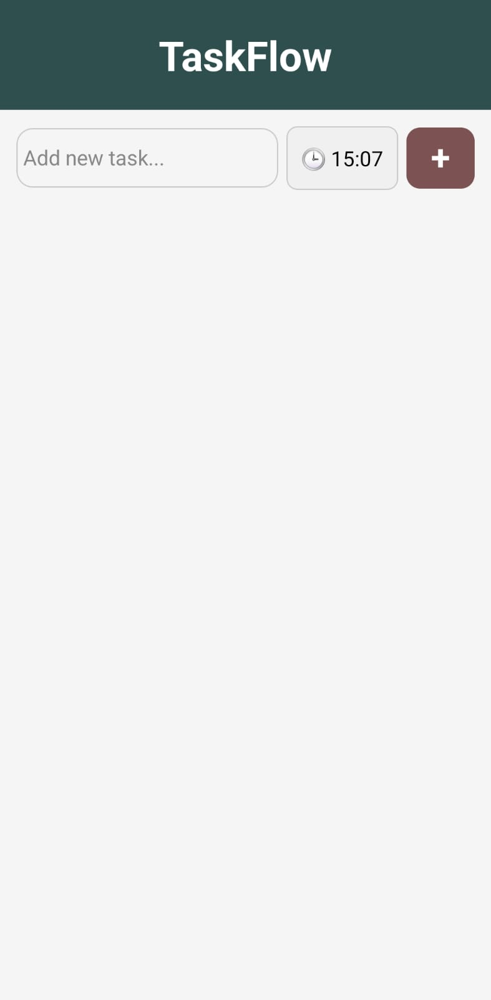

# 📝 TaskFlow — Mobile Task & Schedule Manager

TaskFlow is a clean, lightweight React Native mobile application designed for personal daily task tracking. Built with React Native, Expo, TypeScript, and AsyncStorage, it offers offline-first local data persistence and schedule management.

---

## 📸 App Screenshots

| Home Screen | Task Added | Task Completed | Edit Modal |
| :---: | :---: | :---: | :---: |
|  |  |  |  |

---

## ✨ Primary Features & Functions

- ➕ **Task Creation:** Quickly add tasks with custom text and scheduled times.
- 🕒 **Integrated Time Picker:** Set exact times for tasks using `@react-native-community/datetimepicker`.
- 💾 **Local Data Persistence:** Keeps tasks saved across app restarts using `@react-native-async-storage/async-storage`.
- ✏️ **In-App Editing:** Update task details and scheduled times through a custom pop-up modal.
- ✅ **Task Completion:** Toggle task completion status with interactive checkmarks and strike-through visual feedback.
- 🗑️ **Task Deletion:** Remove completed or obsolete tasks from your schedule.
- 📱 **Cross-Platform & Safe Layout:** Built with `react-native-safe-area-context` to adapt across iOS and Android notches.

---

## 🛠️ Tech Stack

- **Framework:** React Native (Expo)
- **Language:** TypeScript
- **State & Storage:** React Hooks (`useState`, `useEffect`), `@react-native-async-storage/async-storage`
- **UI Components:** `@expo/vector-icons` (Ionicons), `SafeAreaView`, `FlatList`, `Modal`
- **Date/Time Handling:** `@react-native-community/datetimepicker`

---

## 🚀 Getting Started

Follow these steps to get the project running locally on your device or emulator:

### Prerequisites

- [Node.js](https://nodejs.org/) (v16 or higher)
- [Expo Go App](https://expo.dev/go) installed on your physical mobile device (iOS/Android), or an Android Studio / Xcode emulator configured.

### Installation

1. **Clone the repository:**
   ```bash
   git clone https://github.com/Asmar255/Todo-list-App.git
   cd Todo-list-App

```

2. Install dependencies:
Bash

```
npm install

```

3. Start the development server:
Bash

```
npx expo start

```

4. Run on device/emulator:
   * Scan the terminal QR code using your phone camera (iOS) or inside the Expo Go app (Android).
   * Press `a` for Android Emulator or `i` for iOS Simulator in the terminal.

📁 Project Structure
Plaintext

```
TaskFlow/
├── assets/            # App icons, splash screens, and screenshots
├── screens/
│   └── HomeScreen.tsx # Core TaskFlow app view, state, and UI logic
├── App.tsx            # Main application entry point
├── package.json       # Project dependencies and scripts
└── README.md          # Project documentation

```

📄 License
This project is open-source and available under the [MIT License](https://www.google.com/search?q=LICENSE).
